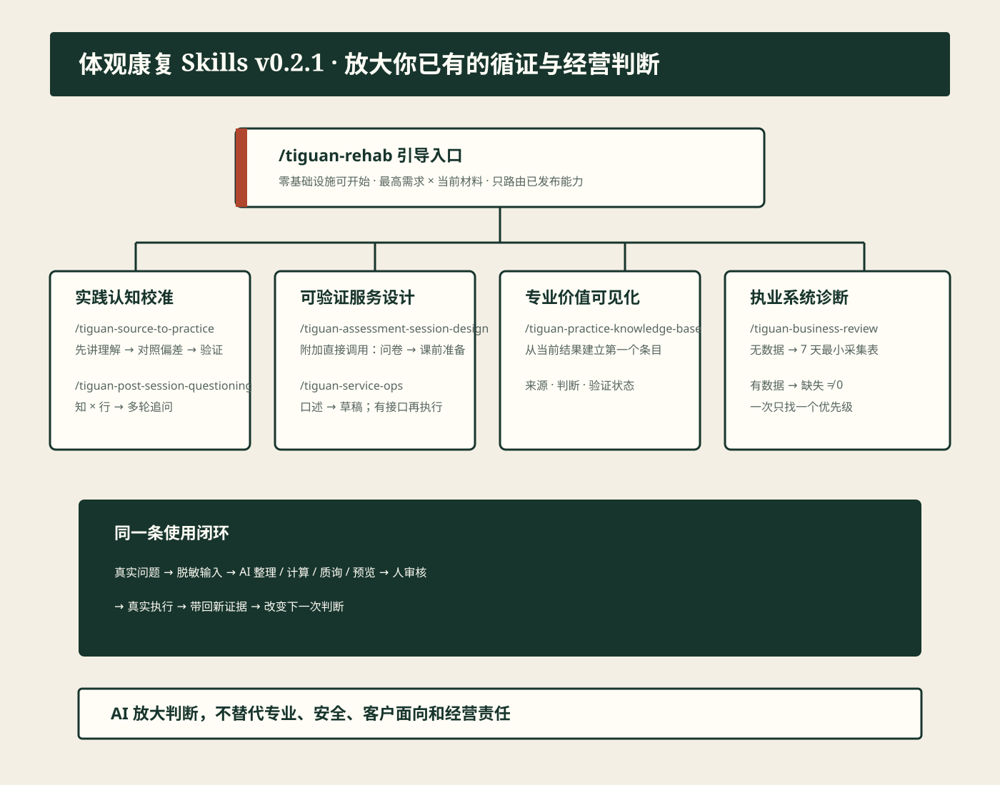

# 体观康复 Skills

简体中文 | [English](README.en.md)

> 让真正的康复，不再被埋没。

[](VERSION)
[](https://skills.sh/Bbaozizz/tiguan-rehab-skills)
[](LICENSE)

**支持：WorkBuddy（macOS 本机实测，Windows 提供原生 PowerShell 安装器与 CI）、Claude Code、Codex，以及其他支持 Agent Skills 的工具。**

这是一套面向康复学生、康复师、个人门店和机构负责人的公开 Skill 组合包。它的目标不是用 AI 替代专业人员，而是放大使用者已有的循证思路、服务判断和经营思路。

**第一次使用不需要先有知识库、客户档案、标准经营表或系统接口。**刚装好 WorkBuddy 的人，只要能提供一份资料、一段脱敏口述或几个经营数字，就能在当前对话里得到第一份可审核结果。现成系统只决定能不能继续自动写入，不决定能不能开始。

**v0.2.2 已发布 7 个 Skill：**`/tiguan-rehab` 是唯一 Day-0 前门，面向五条高频结果路径；本次把经营分析升级为运动健康行业轻量 CFO。评估问卷与课前准备是附加的直接调用能力。规划中的能力不等于已经可安装。



## 这套 Skills 解决什么问题

很多人不是没有循证思路，而是以前只会把 AI 当成“一问一答的搜索框”。这套 Skills 让 Agent 持续追问、记住本轮目标、调用结构和脚本，把一次真实问题推进到可审核结果：

- 给它一份资料，它不先替你总结，而是先让你讲出自己的理解，再找遗漏、误解和过度推断；
- 没有知识库也能先用；当一份结果值得复用时，再从当前对话建立第一个条目；
- 一堂课结束后直接口述，先得到专业记录草稿、客户回家说明和下次关注点；
- 没有客户档案也能开始质询，把口述当作事后新陈述，一次只追一个知行落差；
- 没有经营表先生成 7 天最小采集表，有数据后才判断该先改引流、预约、交付还是消课。

## 快速开始

安装后不需要记住所有名字，也不用先判断该选哪个。只打开引导入口：

```text
/tiguan-rehab 帮我找出现在最值得先解决的问题。
```

它会先一次问一个问题：你最想改善什么、你已经有什么可用材料。然后只在五条 Day-0 路径中选择“命中最高需求，而且现有资料能最快产生反馈”的一条，并在同一个任务里直接开始，不要求你重新调用另一个 Skill。

已经知道任务时可直接调用：

```text
/tiguan-assessment-session-design
这是我现在使用的问卷，请帮我设置成适合自己业务的版本。
```

设置完后，每次只要提供脱敏问卷答案做课前准备。PDF 是可选项，不是默认成功标准。

`/tiguan-assessment-session-design` 是附加的直接调用能力，不参与第一次的五条路径选择。

## 能力一览

| 入口 | 第一次就能感受到的区别 |
| --- | --- |
| `/tiguan-rehab` | 先找最高需求，再匹配已有材料，直接开始最快有反馈的一条路径 |
| `/tiguan-source-to-practice` | 先让你讲出自己的理解，再用资料找出一个真正影响实践的偏差 |
| `/tiguan-practice-knowledge-base` | 不要求已有知识库；从当前结果建立第一个可复用条目 |
| `/tiguan-assessment-session-design` | 上传自己的问卷，再用问卷答案生成课前准备 |
| `/tiguan-service-ops` | 没有档案也能把一次脱敏口述变成记录草稿、客户回家说明和下次关注点 |
| `/tiguan-post-session-questioning` | 没有档案也可口述开始；不交一份报告，一次只追一个知行落差 |
| `/tiguan-business-review` | 没数据先建 7 天采集口径；有数据算现金、交付、剩课责任、三条经营线、现实产能和一个当前优先级 |

它们分别覆盖四个长期能力簇：**实践认知校准**、**可验证服务设计**、**专业价值可见化**、**执业系统诊断**。

## 安装

### WorkBuddy 一键安装

#### macOS

需要系统可用的 Python 3；安装器会在下载或写入前检查并给出明确错误。

```bash
curl -fsSL https://raw.githubusercontent.com/Bbaozizz/tiguan-rehab-skills/main/tools/install-workbuddy.sh | bash
```

#### Windows

```powershell
irm https://raw.githubusercontent.com/Bbaozizz/tiguan-rehab-skills/main/tools/install-workbuddy.ps1 | iex
```

安装器只管理 `~/.workbuddy/skills` 下面的 7 个体观 Skill 目录，不删除其他 Skill。完成后刷新或重启 WorkBuddy，输入 `/tiguan-rehab 帮我找出现在最值得先解决的问题`。

### 其他支持 Agent Skills 的工具

```bash
npx -y skills add Bbaozizz/tiguan-rehab-skills -g --all
```

### 更新

对 Agent 说“更新体观康复 Skills”，或重新执行对应安装命令。更新不会覆盖你自己生成的文件。版本变化见 [Releases](https://github.com/Bbaozizz/tiguan-rehab-skills/releases)。

## 它怎样工作

```text
真实问题
  -> 脱敏输入与来源指针
  -> 最高需求 × 已有材料
  -> 路由并直接开始一个 Skill
  -> AI 整理 / 计算 / 质询 / 生成预览
  -> 使用者审核和决定
  -> 真实执行
  -> 带回新证据
```

主动学习和课后质询是高判断任务，由模型多轮工作；经营比率等确定性部分由脚本复算；真实系统写入必须经过预览、确认和回读。一个写得好的 Prompt 可以成为 Skill 的核心，但最终效果必须说清：第一次能得到什么、缺什么时怎样继续、什么事情它没有真的执行。

## 隐私与临床边界

- 使用合成或已脱敏输入，不提交联系方式、完整病历、可识别影像、客户数据库、凭证或原始对话。
- AI 不诊断、不开处方、不决定动作/剂量/进阶，不自动发送客户消息。
- 运营写入默认只预览；只有用户自己已配置官方适配器、看到本轮预览并明确确认后，才能执行与回读。
- 安装、文件生成、脚本通过和即时变化都不等于临床效果或经营结果。

## 开源路线图

当前开放的是可脱敏、可安装、可独立验证的通用判断结构和脚本。个人客户资料、内部数据库、凭证、私有写入脚本和未脱敏业务逻辑不进入公开仓库。

后续能力只有在具有独立真实任务、核心判断和验收方式时才新增，不会为了显得多而无限拆 Skill。

## 项目结构

```text
skills/                 # 7 个已发布 Skill
docs/                   # 完整使用手册与能力地图
tools/                  # 安装、校验、隐私门禁与打包
tests/                  # 公开合同、计算和安装器测试
.claude-plugin/         # Claude Code 插件定义
```

## 许可证

[CC BY-NC 4.0](LICENSE)。个人、教育、研究和非商业使用需保留署名；商业使用需单独获得许可。
